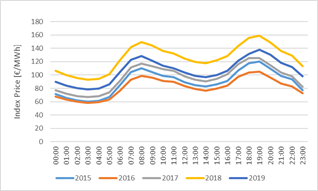
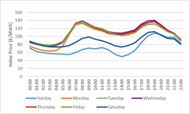
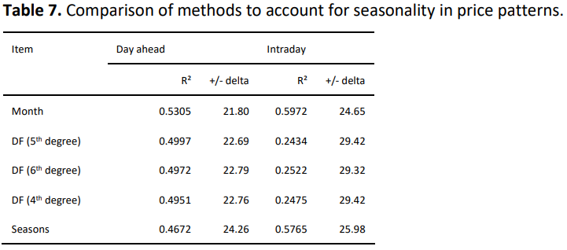
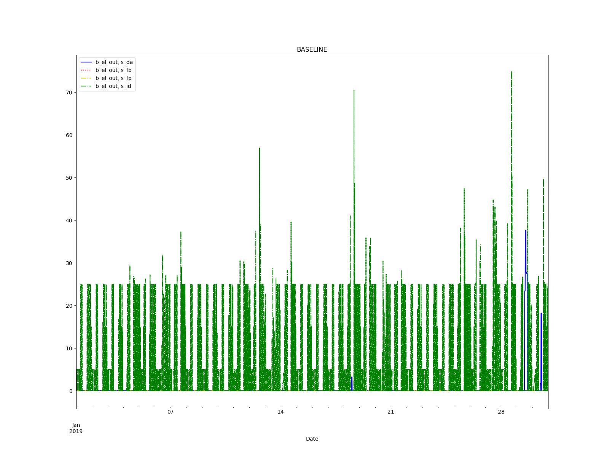
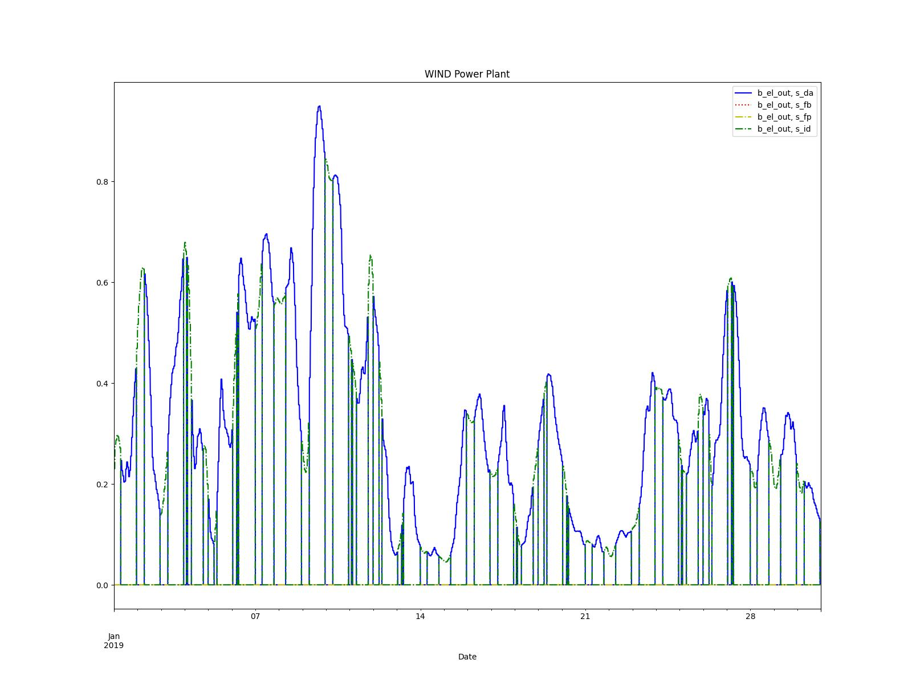

===========
Electricity Markets Lib
===========

**A market model for selling or buying electricity on several markets with obligatory physical fulfillment**

.. contents::
    :depth: 2
    :local:
    :backlinks: top

Introduction
===========
Project to model the trading of electricity to different markets.
The markets are set up as sinks or sources of electricity.
The core ideas of MarketLib is to have an easy and quick ways to add markets to your modell.
The model is for selling or buying electricity to or from different markets.
The markets are modeled as physical markets.
Once a product is bought/sold it will be physically fulfilled.

Main file for modeling of the different markets as examples are in.
::

	main.py

The first sets of models consider a district with different
power sources and four different markets to sell excess energy and minimize costs/maximize profits.

For analysis, scenarios with different market prices (inflated) are
build to study the functionality of the model.

The second set of models considers only one type of power plant with four 
different markets and analyzes which is the best option for selling energy,
considering only operational costs.

Documentation
===========
The documentation is part of this README and the comments in the code.
The MarketLib is not yet powered by the readthedocs. 

Installation
===========

If you have a working Python3 environment, use pypi to install the latest oemof version. Python >= 3.6 is recommended. Lower versions may work but are not tested.

Currently an installation through pip + git is required.
::

	pip install git+https://github.com/Fernando3161/EnergyMarketsSimulation.git

After publishing an installation through pip shall be possible
::

    pip install electricity_markets
    
Repository Structure Structure
===========
Market Models
-----------------

Market Price Generator
-----------------
Project to create price pattern for energy markets based on historical prices.

After installation, the following are examples of how to create and save price patterns into csv files

::

	from electricity_markets.market_price_generator import create_markets_info
		
	# Creates Price Profiles with standard information
	create_markets_info(2019, save_csv=True)
		
	# Creates Price Profiles with partial custom information
	create_markets_info(year=2021, mean_da=75, mean_id=60, save_csv=True)
	    
	# Creates Price Profiles with full custom information
	create_markets_info(year=2030, mean_da=75, mean_id=60, fb=75, fp=80, save_csv=True)

The function market_price_generator.create_markets_info() creates market price time series for historical and future years.
For historical time series the year is necessary parameter.
For future years there are necessary and optional parameter:

**Necessary**

* year

**Optional**

* mean_da: Mean Day Ahead price. Required for years 2022 an onwards
* mean_id: Mean Intraday price. Required for years 2022 an onwards
* fb: Future Base Prices. Required for years outside of 2018-2025
* fp: Future Peak Prices. Required for years outside of 2018-2025

For years 2015-2017: Uses DA and ID market data, FP and FB must be given.
For years 2018-2020: Uses DA, ID, FP, and FB market data. None must be given.
For years 2021-2025: Uses FB and FP market data. DA and ID must be given.
For years 2025-: DA, ID, FP and FP market data must be given.

The methodology implemented in this library is described in `this <https://doi.org/10.1002/ceat.202100062>`_ scientific paper:
Support Information can be found `here <https://onlinelibrary.wiley.com/action/downloadSupplement?doi=10.1002%2Fceat.202100062&file=ceat202100062-sup-0001-misc_information.pdf>`_.

The price pattern dimensions are:

* Time
* Day (typical days)
* Month
 

This is due to the findings of the mentioned paper:
1. Price pattern barely depend on the years:

..
	https://user-images.githubusercontent.com/25903724/150540178-f7e3ebc9-5886-4c93-b86d-bbda13020f1a.png

2. Price pattern depend very much on the days:

..
	https://user-images.githubusercontent.com/25903724/150540240-44f64eb8-9c68-4db4-aeee-a56670c2af31.png

3. Seasonality can be mapped well via the months parameter (in comparision to dynamic functions and seasons)

..
	https://user-images.githubusercontent.com/25903724/150540842-64b364e8-be71-4cf9-8687-09c7516c5f34.PNG

Example 1 - District Modell
-----------------

Creates a model with demands for a district and several power plants.
There are 4 different scenarios with prices inflated to show preference for different markets (The baseline scenario shows strong preference towards
the Intraday market)

The Energy System of the District consists of:

* PV System
* Electric Storage
* Gas Boiler
* CHP
* Thermal Storage
* Electric Grid
* Gas Grid
* Electric bus for selling energy
* 4 Sinks for selling energy representing the 4 electric markets

Results of the resulting electric energy being sold to external markets are shown in the following figure:

Example 2 - Power Plants Models
-----------------
This example models the different power plants and their outputs
in the different markets.

An small energy system is built with One power plant connected to the different energy markets (Sinks) to optimize the selling of energy and maximize profits.

Several scenarios consider Coal, Gas, Biogas, Photovoltaic, and Wind power plants.

Results are saved into an .xlsx file whre KPIs are analized.

Contributing
============

A warm welcome to all who want to join the developers and contribute to
MarketLib.

You can approach us via the issues and comment section.

Citing
======

For citing the Price Pattern Methodology, you might want to refer to
`DOI:10.1002/ceat.202100062 <https://doi.org/10.1016/j.simpa.2020.100028>`_,
which gives an overview over the European electricity exchanges and the modelling of markets.
